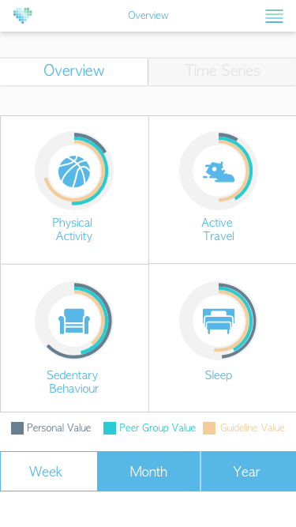
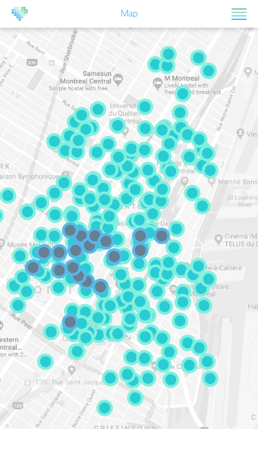

Daniel Fuller, Ph.D.  
Canada Research Chair in Population Physical Activity  
Assistant Professor  
School of Human Kinetics and Recreation   
Physical Education Building PE 2024 Memorial   
University of Newfoundland St. John’s, NL  
A1C 5S7  
Tel: (709) 864-7270    
E-mail: dfuller@mun.ca    
Web: [http://www.walkabilly.ca/](http://www.walkabilly.ca/)  

## Research Overview

My research involves using mobile health technologies including smartphones and wearable devices to understand and increase physical activity. This work is focused on understanding how the urban environment influences our physical activity and transportation decisions. The interdisciplinary nature of my work means that I published in a variety of venues including public health, transportation, and computer science journals. I believe my work is innovative in that I collaborate extensively with colleagues for many disciplines and I publish novel work across disciplines. 

I have published 36 peer reviewed academic papers since 2016 and currently have 17 papers submitted and under review. I have received funding for two major research projects; the INTErventions, Research, and Action in Cities Team (Co-PI)(Kestens et al., 2019) a $2M CIHR Team Grant and the Canadian Urban Environmental Health Research Consortium (Co-I and team lead)(Brook et al., 2018) a $5M CIHR Consortium. Along with that funding I am a Tier 2 Canada Research Chair (CRC) and have funding for the Canada Foundation for Innovation John Edwards Leaders Fund. The value of my CRC award is approximately $1M. 

I have published in major journals in my field including the _Journal of Epidemiology and Community Health_, the _International Journal of Behavioral Nutrition and Physical Activity_, and the _British Journal of Sports Medicine_. I have also published in top computer science and transportation journals including _ACM Transactions on Spatial Algorithms and Systems_ and _Transportation Research Record_. 

My vision is    

> A physically active Canadian population

My mission is  

> To conduct research that will help design urban and rural environments that equitably increase physical activity for the entire population

## Research Program

My research program began in the field of healthy cities, with my PhD focused on evaluating the impacts of a public bicycle share program on cycling, crashes, and mobility. My research continues to focus on healthy cities and evaluating the impact of different built environment and urban policy changes on health. However, my field has also begun to collect Global Positionning System (GPS) and accelerometer data on a large scale. As a result, I have take what I call a methodological detour. This detour is focused on the scale up of physical activity and mobility measurement using multiple devices including commercial wearables with GPS. As a result of this work, I have collaborated with computer science and geography researchers, in order to develop new methods to understanding wearable device and GPS data. 

### Healthy Cities

My healthy cities research is focused on evaluating the impact of natural experiments, where the researcher does not control the implementation or the distribution of participants to intervention groups. I have published a number of studies using state of the art methods in this field. Most recently, I have published about the impact of bicycle share programs on crashes in 8 North American cities and on the effect of a public transit strike on cycling in Philadelphia. See example publications below. 

* Brandon Calles M, Hosford K, Winters M, Gauvin L, __Fuller D__. The impact of implementing public bicycle share programs on bicycle crashes: the International Bikeshare Impacts on Cycling and Collisions Study (IBICCS). Transport Findings. September. [https://doi.org/10.32866/001c.16724](https://doi.org/10.32866/001c.16724)
* __Fuller, D.,__ *Luan, H.,* Buote, R., Auchincloss, A. H. Impact of a public transit strike on public bicycle share use: An interrupted time series natural experiment study. Journal of Transportation and Health. 2019;13:137-142. [https://doi.org/10.1016/j.jth.2019.03.018](https://doi.org/10.1016/j.jth.2019.03.018)

### Commercial Wearable Devices

My commercial wearable device research is focused in two broad areas. First, in understanding the reliability and validity of commercial wearable devices and developing new methods for prediction physical activity types from multiple commercial wearables. Second, my work is focused on developing methodological tools to simply other researchers working with these types of data. This work is done using the R Statistical Programming Language [https://cran.r-project.org/](https://cran.r-project.org/). See example publications below. 

* __Fuller, D.__, Colwell, E., Low, J., _Orychock, K._, _Tobin, M._, _Simango, B._, Buote, R., _van Heerden, D._, _Slade, L._, _Luan, H._, _Taylor, G. A. N._, Cullen, K. Systematic Review of the Reliability and Validity of Commercially Available Wearable Devices for Measuring Steps, Energy Expenditure, and Heart Rate. JMIR MHealth. JMIR Mhealth Uhealth 2020;8(9):e18694. [http://dx.doi.org/10.2196/18694](http://dx.doi.org/10.2196/18694)
* _KhataeiPour S_, _Brondeel R_, _Rahimipour Anaraki J_, __Fuller D__. activityCounts: Generate ActiLife Counts. [https://cran.r-project.org/web/packages/activityCounts/index.html](https://cran.r-project.org/web/packages/activityCounts/index.html)

### Global Positionning System Methods

My research using global positioning systems is focus on developing new metrics for understanding human behaviour and mobility from GPS data. These data are highly complex and I have been working with different collaborators to try and understanding how these data can be used to predict the transportation mode a person is using and more generally to understanding how movement patterns can be used predict social group membership or even the city where you live. See example publications below. 

* _Roy A_, __Fuller D__, Stanley K, Nelson T. Global Positioning Systems and accelerometer data: A machine learning approach. Transport Findings. September. [https://doi.org/10.32866/001c.14520](https://doi.org/10.32866/001c.14520)
* _Zhang R_, Stanley K, **Fuller D,** Bell S. Differentiating Population Spatial Behavior using Representative Features of Geospatial Mobility (ReFGeM). Transactions on Spatial Algorithms and Systems. 2020:6(1). [https://dl.acm.org/doi/10.1145/3362063](https://dl.acm.org/doi/10.1145/3362063)

## Research Leadership

The BEAP (Built Environment and Active Populations) Lab is a multidisciplinary lab that is focused on achieving my vision and mission. The lab is home to students with training in kinesiology, public health, computer science, and anthropology. We have developed detail documentation and introduction to the Lab (https://github.com/walkabillylab/labguide/blob/master/Guide.md). 

The lab has produced a number of different publicly available products in the R Statistical Programming Language. These include functions that will extract the time zone from global positioning system data (https://github.com/walkabillylab/LocationToTimezone), and implementation of the Sedentary Sphere algorithm (https://github.com/walkabillylab/SedentarySphere). 

The lab has also developed an iOS app titled PASS (Physical Activity, Sleep, Sedentary Behaviour) Mobile. The app collects data from FitBit and Apple Watch. We are planning further developments of the app to include Garmin and Samsung wearable devices. The app is not publicly available on the app store but I plan to release the app in the 2020-2021 academic year. 

   

### Speakers Invited to Memorial University

1. Dr. Amy Auchincloss, Professor, School of Public Health, Drexel University. October 20th - November 3rd, 2016. 
2. Dr. Kevin Stanley, Professor, Department of Computer Science, University of Saskatchewan. September 26, 2016.
3. Dr. Steven Hoffman, CIHR Institute of Population and Public Health, York University. October 17-18, 2016.

### National Leadership

I am currently the [Neighbourhoods Factors Team co-lead](http://canue.ca/leadership-and-staff/#toggle-id-24) with Dr. Michael Widener, Unviersity of Toronto, of the Canadian Urban Environmental Health Research Consortium (CANUE). CANUE is a $5 Million grant funded by the CIHR Institute of Population and Public Health with the vision to:  

  * *Increase scientific understanding of the interactions among the physical features of the urban   environment and health. This understanding will lead to cost-effective actions that promote healthy childhood development and aging, reduce the burden of chronic disease, and minimize the impact of changing environments.*

### Workshops

I hosted 2 workshops in 2017-2018.  

1. "The Future of Walkability Measurement in Canada" workshop on attended by 18 researchers from across Canada. November 16 and 17, 2017.
2. "Itinerum Smartphone App" workshop with Dr. Zachary Patterson from Concordia University. Approximately 20 students attended. October 20th 2017. 

## Publications

I published 36 peer reviewer scientific articles in since 2016. I am the first or lead author on 16 of the publications. Nineteen of the publications were lead by trainees. I also have 17 publications currently under review. 

Authorship norms for my discipline are as follows. First author typically conceptualized the study did the majority of the data analysis and writing. In the case of students (identified in *italics* here) the supervisor is the last author. 

### Published and in Press Peer Reviewed Papers

#### In Press
None

#### Published

1. __Fuller, D.__, Colwell, E., Low, J., _Orychock, K._, _Tobin, M._, _Simango, B._, Buote, R., _van Heerden, D._, _Slade, L._, _Luan, H._, _Taylor, G. A. N._, Cullen, K. Systematic Review of the Reliability and Validity of Commercially Available Wearable Devices for Measuring Steps, Energy Expenditure, and Heart Rate. JMIR MHealth. JMIR Mhealth Uhealth 2020;8(9):e18694. [http://dx.doi.org/10.2196/18694](http://dx.doi.org/10.2196/18694)
1. Brandon Calles M, Hosford K, Winters M, Gauvin L, __Fuller D__. The impact of implementing public bicycle share programs on bicycle crashes: the International Bikeshare Impacts on Cycling and Collisions Study (IBICCS). Transport Findings. September. [https://doi.org/10.32866/001c.16724](https://doi.org/10.32866/001c.16724)
1. _Roy A_, __Fuller D__, Stanley K, Nelson T. Global Positioning Systems and accelerometer data: A machine learning approach. Transport Findings. September. [https://doi.org/10.32866/001c.14520](https://doi.org/10.32866/001c.14520)
1. Nelson, T., Ferster, C., Laberee, K. __Fuller, D.__, Winters, M. Crowdsourced data for bicycling research and practice. Transport Reviews. 2020.  [https://doi.org/10.1080/01441647.2020.1806943](https://doi.org/10.1080/01441647.2020.1806943)
1. Firth CL, __Fuller D,__ Wasfi R, Kestens Y, Winters M. Causally speaking: challenges in measuring gentrification for population health research. Health & Place. 2020. 63, 102350. [https://doi.org/10.1016/j.healthplace.2020.102350](https://doi.org/10.1016/j.healthplace.2020.102350)  
1. Auchincloss, A., Michael, Y., __Fuller, D.__, Li, S., Niamatullah, S., Fillmore, C., Setubal, C.,  Bettigole, C. Designing bikeshare to promote equity: baseline analysis of the Drexel Neighborhood Transportation Study (DNTS) cohort. Journal of Transportation and Health. 2020, 16, 100836. [https://doi.org/10.1016/j.jth.2020.100836](https://doi.org/10.1016/j.jth.2020.100836)
1. _Zhang R_, Stanley K, **Fuller D,** Bell S. Differentiating Population Spatial Behavior using Representative Features of Geospatial Mobility (ReFGeM). Transactions on Spatial Algorithms and Systems. 2020:6(1). [https://dl.acm.org/doi/10.1145/3362063](https://dl.acm.org/doi/10.1145/3362063)
1. _Hosford, K._, Winters, M., Gauvin, L., Camden, A., Dube, A-S., Friedman, S. M., __Fuller, D.__. Evaluating the impact of implementing public bicycle share programs on cycling: The International Bikeshare Impacts on Cycling and Collisions Study (IBICCS). International Journal of Behavioural Nutrition and Physical Activity. 2019:16, 107. [https://doi.org/10.1186/s12966-019-0871-9](https://doi.org/10.1186/s12966-019-0871-9)
1. _Hosford, K._, Winters, M., __Fuller, D.__. Commentary on: Burn Calories, Not Fuel! The effects of bikeshare programs on obesity rates. Transportation Research Part D: Transport and Environment. 2019:75, 121-122. [https://doi.org/10.1016/j.trd.2019.08.028](https://doi.org/10.1016/j.trd.2019.08.028) 
1. __Fuller, D.__, Stanley, K. G. The future of activity space and health research. Journal of Health and Place. 2019:58, 102131. [https://doi.org/10.1016/j.healthplace.2019.05.009](https://doi.org/10.1016/j.healthplace.2019.05.009)
2. Thigpen, C. Winters, M. **Fuller, D.** Gauvin, L. Therrien, Nelson, T. Who is ready to bicycle?: Categorizing and mapping bicyclists with behavior change theory. Transport Policy. 2019:83, 11-17. [https://doi.org/10.1016/j.tranpol.2019.07.011](https://doi.org/10.1016/j.tranpol.2019.07.011)
3. Engler-Stringer, R. **Fuller, D.** Abeykoon, A.M. H. Olauson, C. Muhajarine, N. Perspectives on the Failure of New Grocery Store Interventions in Former Food Deserts. Health Education and Behaviour. 2019, 45(5). [https://doi.org/10.1177/1090198119853009](https://doi.org/10.1177/1090198119853009)
4. *Breslin, S.*, Shareck, M., **Fuller, D.** Research ethics for mobile sensing device use by vulnerable populations. Social Science and Medicine. 2019;232:50-57. [https://doi.org/10.1016/j.socscimed.2019.04.035](https://doi.org/10.1016/j.socscimed.2019.04.035)
5. __Fuller, D.,__ *Luan, H.,* Buote, R., Auchincloss, A. H. Impact of a public transit strike on public bicycle share use: An interrupted time series natural experiment study. Journal of Transportation and Health. 2019;13:137-142. [https://doi.org/10.1016/j.jth.2019.03.018](https://doi.org/10.1016/j.jth.2019.03.018)
6. *Luan, H*., *Ramsay, D.*, **Fuller, D.** Household income, active travel, and their interacting impact on body mass index in a sample of urban Canadians: A Bayesian spatial analysis. International Journal of Health Geographics. 2019;18(4). [https://doi.org/10.1186/s12942-019-0168-x](https://doi.org/10.1186/s12942-019-0168-x)
7. Branion-Calles M, Nelson T, **Fuller D**, Gauvin L, Winters M. Associations between spatial access to bicycle-specific infrastructure, sociodemographic characteristics, and city-wide safety perceptions of bicycling: a cross-sectional survey of bicyclists in 6 Canadian and U.S. cities. Transportation Research Part A: Policy and Practice. 2019, 123: 229-239. [https://doi.org/10.1016/j.tra.2018.10.024](https://doi.org/10.1016/j.tra.2018.10.024) 
8. Kestens Y, Winters M, **Fuller D,** Bell S, Berscheid J, Brondeel R, Cantinotti M, Datta G, Gauvin L, Gough M, Laberee K, Lewis P, Lord S, Luan H, McKay H, Morency C, Muhajarine N, Nelson T, Ottoni C, Poirier Stephens Z, Pugh C, Rancourt G, Shareck M, Sims-Gould J, Sones M, Stanley K, Thierry B, Thigpen C, Wasfi R. INTERACT: A comprehensive approach to assess urban form interventions through natural experiments. BMC Public Health. 2019;19(1):51. [https://doi.org/10.1186/s12889-018-6339-z](https://doi.org/10.1186/s12889-018-6339-z)
9. __Fuller D__, Neudorf J, Lockhart S, Plante C, Roberts H, Bandara T, Neudorf C. Individual- and area-level socioeconomic inequalities in diabetes mellitus in Saskatchewan between 2007 and 2012: a cross-sectional analysis. Canadian Medical Association Journal Open. 2019;7(1):E33-E39. [https://doi.org/10.9778/cmajo.20180042](https://doi.org/10.9778/cmajo.20180042)
11. *Hosford, K*., Lear, S A., **Fuller, D**., Teschke, Therrien, S., Winters. Who is in the near market for bicycle sharing? Identifying current, potential, and unlikely users of a public bicycle share program in Vancouver, Canada. BMC Public Health. 2018, 18: 1326. [https://doi.org/10.1186/s12889-018-6246-3](https://doi.org/10.1186/s12889-018-6246-3)
11. Winters M, Fischer J, **Fuller D**, Gauvin L, Whitehurst DGT, Nelson T. Equity In Spatial Access To Bicycling Infrastructure In Mid-Sized Canadian Cities. Transportation Research Board. 2018, 2672:36. [https://doi.org/10.1177/0361198118791630](https://doi.org/10.1177/0361198118791630) 
12. *Hosford, K*., **Fuller, D**., Lear, S A., Teschke, K., Gauvin, L., Brauer, M., Winters. Evaluation of the impact of a public bicycle share program on population bicycling in Vancouver, BC. Preventive Medicine Reports. 2018, 12:176-181. [https://doi.org/10.1016/j.pmedr.2018.09.014](https://doi.org/10.1016/j.pmedr.2018.09.014) 
13. Winters M, Branion-Calles M, Therrien S, **Fuller D**, Gauvin L, Whitehurst DGT, & Nelson T. Impacts of Bicycle Infrastructure in Mid-Sized Cities (IBIMS): protocol for a natural experiment study in three Canadian cities. BMJ Open 2018;8:e019130. [https://dx.doi.org/10.1136/bmjopen-2017-019130](https://dx.doi.org/10.1136/bmjopen-2017-019130)
14. *Alphonsus, K.*, Waldner, C., **Fuller D**. Examining the Association between Area Level Deprivation and Vehicle Collisions. Canadian Journal of Public Health. 2018, 109:43–51. [https://dx.doi.org/10.17269/s41997-018-0036-7](https://dx.doi.org/10.17269/s41997-018-0036-7)
15. Brook JR, Setton EM, Seed E, Shooshtari M, Doiron D, and the CANUE – The Canadian Urban Environmental Health Research Consortium. The Canadian Urban Environmental Health Research Consortium – a protocol for building a national environmental exposure data platform for integrated analyses of urban form and health. BMC Public Health. 2018, 18:114. [https://doi.org/10.1186/s12889-017-5001-5](https://doi.org/10.1186/s12889-017-5001-5)
16. Sones M, **Fuller D**, Kestens Y, Winters M. If we built it, who will come? The case for attention to equity in healthy community design. British Journal of Sports Medicine. 2018, 53(8). [http://dx.doi.org/10.1136/bjsports-2018-099667](http://dx.doi.org/10.1136/bjsports-2018-099667)
22. Pabayo, R., **Fuller, D.**, Lee, E.Y., Horino, M., Kawachi, I. State-level income inequality and meeting physical activity guidelines; differential associations among US men and women, Journal of Public Health. 2018, 2:229–236. [https://doi.org/10.1093/pubmed/fdx082](https://doi.org/10.1093/pubmed/fdx082)
18. **Fuller D.**, Winters M. Income inequalities in Bike Score and bicycle to work mode share in Canadian cities. Journal of Transportation and Health. 2017, 7(B): 264-268. https://doi.org/10.1016/j.jth.2017.09.005 
18. **Fuller D.**, Shareck M, Stanley C. Ethical implications of tracking participants for health research studies with mobile sensing devices. Social Science and Medicine. 2017, 191, 84-88 [https://doi.org/10.1016/j.socscimed.2017.08.043](https://doi.org/10.1016/j.socscimed.2017.08.043)
19. **Fuller, D.**, Buote, R., Stanley, K. A Glossary for Big Data in Population and Public Health: Discussion and Commentary on Terminology and Research Methods. Journal of Epidemiology and Community Health. 2017, 71:1113-1117. [http://dx.doi.org/10.1136/jech-2017-209608](http://dx.doi.org/10.1136/jech-2017-209608) 
20. *Hasselback*, J., Schwandt, M., **Fuller, D.** Choosing Tools for Building Health Spaces: A Global Overview. Cities and Health. 2017, 1: 31-37. [http://dx.doi.org/10.1080/23748834.2017.1309091](http://dx.doi.org/10.1080/23748834.2017.1309091)
21. McGowan, E., **Fuller, D.**, Cutumisu, N., North, S., & Courneya, K. Examining Whether Built Environment Factors are Effect Modifiers in a Randomized Controlled Trial to Increase Physical Activity among Men with Prostate Cancer: The PROMOTE Trial. Supportive Care in Cancer. 2017, 25(10), 2993–2996. [https://doi.org/10.1007/s00520-017-3798-1](https://doi.org/10.1007/s00520-017-3798-1)
23. Pabayo, R., **Fuller, D.**, Goldstein, R.B., Kawachi, I., Gilman, S.E. Income inequality among American states and the conditional risk of post-traumatic stress disorder. Soc Psychiatry Psychiatr Epidemiol 2017, 52: 1195. [https://doi.org/10.1007/s00127-017-1413-x](https://doi.org/10.1007/s00127-017-1413-x) 
25. **Fuller, D.**, Engler-Stringer, R., Muhajarine, N. Retail food environments research: Promising future with more work to be done. Canadian Journal of Public Health. 2016, 107(0): 5622. [http://dx.doi.org/10.17269/cjph.107.5622](http://dx.doi.org/10.17269/cjph.107.5622)
25. Sullivan, E., **Fuller, D.**, Paterson, Q. S., Huffman, S., Challa, S., Woods, R. Emergency Physicians as human billboards for injury prevention: A randomized controlled trial. Canadian Journal of Emergency Medicine. 2016, 19(4):277-284. [http://dx.doi.org/10.1017/cem.2016.366](http://dx.doi.org/10.1017/cem.2016.366)
26. Winters, M., Teschke, K., Brauer, M., **Fuller, D.** Bike Score®: Associations between urban bikeability and cycling behavior in 24 cities. International Journal of Behavioral Nutrition and Physical Activity. 2016, 13:18 [https://doi.org/10.1186/s12966-016-0339-0](https://doi.org/10.1186/s12966-016-0339-0) 
27. **Fuller, D.**, Neudorf, J., Bermedo-Carrasco, S., Neudorf, C. Classifying the population by socio-economic factors associated with support for policies to reduce social inequalities in health. Journal of Public Health.  2016, 38(4), 635-643. [http://www.dx.doi.org/10.1093/pubmed/fdv201](http://www.dx.doi.org/10.1093/pubmed/fdv201) 

### Submitted Publications Under Review

#### Physical Activity Measurement 
1. __Fuller D__, Rahimipour Anaraki J, _Simango B_, Dorani F, Bozorgi A, _Luan H_. Predicting sleep, sedentary behaviour, and physical activity with Apple Watch and Fitbit using Rotation Forest models. Sensors.
3. __Fuller D__, Rahimipour Anaraki J, _Simango B_, Dorani F, Bozorgi F, _Luan D_, Basset F. Using machine learning methods to predict physical activity types with Apple Watch and Fitbit data using indirect calorimetry as the criterion. Medicine and Science and Sport and Exercise.
4. _Brondeel, R._, Kestens, Y., _Rahimipour Anaraki, J._, Stanley, K., Thierry, B., __Fuller, D.__ Converting raw accelerometer data to activity counts using open source code in MATLAB, Python, and R – a comparison to ActiLife activity counts. International Journal of Behavioural Nutrition and Physical Acitivity.
5. _Angarita-Fonseca A_, Trask C, Pahwa P, __Fuller D__, Bath B. Physical activity and chronic back disorders: A repeated measures analysis of a 16-year prospective cohort study. Preventive Medicine. Preventive Medicine..
6. _Angarita-Fonseca A_, Trask C, Pahwa P, Herman H, __Fuller D__, Bath B. Is meeting Canadian physical activity guidelines associated with Chronic Back Disorders? A comparison between self-reported and accelerometer-measured physical activity. Spine. 
 
#### Healthy Cities

1. Firth, C.L., Thierry, B., __Fuller, D.__, Winters, M., Kestens, Y. Gentrification, Urban Interventions, and Equity (GENUINE): a map-based gentrification tool for Canadian Metropolitan Areas. 2020. Health Reports.
1. Diaz F, Abbassi J, __Fuller D__, Diab E. Canadian Transit Agencies Response to COVID-19: Understanding Strategies, Information Accessibility and the Use of Social Media. Transportation Research Board.
3. __Fuller D__, _Tobin M_, _Orychock K_, Ross N, Hajna S, DeVries M, Villeneuve P J, Frank L D, McCormack G, Wasfi R, Steinmetz-Wood M, Gilliland J, Booth GL, Winters M, Kestens Y, Manaugh K, Rainham D, Gauvin L, Widener M J, Muhajarine N, _Luan H_. Active Living Environments: Re-Framing and Defining the Concept of Walkability. BMC Public Health. 
4. Wasfi R, Poirier Stephens Z, Sones M, Laberee K, Gough M, Pugh C, __Fuller D__, Winters M, Kestens Y. Recruiting Participants for Population Health Intervention Research: Effectiveness and Costs of Recruitment Methods for the INTErventions, Research, and Action in Cities Team (INTERACT) study. Journal of Medical Internet Research. 
5. Sones M, Firth CL, __Fuller D__, Holden M, Kestens Y, Winters M. Situating social connectedness in healthy cities: A conceptual primer for research and policy. Cities and Health. 
6. Firth CL, Poirier Stephens Z,  Cantinotti, M,  __Fuller D,__ Kestens Y, Winters M. (2020). Successes and failures of built environment interventions: using concept mapping to assess stakeholder perspectives in four Canadian  cities. Social Science and Medicine.
7. Parenteau, N., __Fuller, D.__, Najjar, M., Poirier Stephens, Z., Rancourt, G., Winters, M., Kestens, Y. Do travel modes contribute to well-being? A cross-sectional analysis considering enjoyment, gender, and education. Journal of Transport and Health.
8. Whitehurst, D., DeVries, D., Fuller, D., Winters, M. An economic analysis of health-related benefits of bicycle infrastructure investment in three Canadian cities. Canadian Journal of Public Health. 
9. Bree. S., __Fuller. D.__, Diab, E. Access to Transit? Validating Local Transit Accessibility Measures Using Transit Ridership. Transportation Research Part A: Policy and Practice.
10. Bird, M. Barnett, T.A. Mathieu, M-E. **Fuller, D.** Geetanjali D D. Multidimensional School Features Associated with Physical Activity among Youth at Risk of Obesity: An Exploratory Principal Component and Generalized Estimating Equation Analysis. Health and Place.
11. _Hosford, K._ Laberee, K. __Fuller, D.__ Kestens, Y. Winters, M. Are They Really Interested but Concerned? A Mixed Methods Exploration of the Geller Bicyclist Typology. Transportation Research Part F: Psychology and Behaviour.
12. Alhassan J A K, Gauvin L, Judge A, __Fuller D__, Engler-Stringer R, Muhajarine R. Improving Health through Multisectoral Collaboration: Enablers and Barriers. Canadian Journal of Public Health

### Technical Reports Relevant to Academic Field

1. Holloway A, Chafe B, Fuller D.  Health and economic benefits of walking in St. John’s, Newfoundland and Labrador. [http://www.beaplab.com/home/wp-content/uploads/2020/08/HEAT-St-Johns.pdf](http://www.beaplab.com/home/wp-content/uploads/2020/08/HEAT-St-Johns.pdf)
1. Vanlaar W, Woods-Fry H, Mainegra Hing M, Robertson R, Laberee K, Ferster C, and  Nelson T. Bikemaps.org: Final report on the evaluation of a crowdsourced tool to compile, analyze and communicate data about cycling safety. 2020. Traffic Injury Research Foundation. 
1. Fuller D, Butt R. Report from the Bicycle Network Design Jam. 2018 ISBN: 978-0-88901-488-6. [http://www.beaplab.com/home/wp-content/uploads/2019/01/Design-Jam.pdf](http://www.beaplab.com/home/wp-content/uploads/2019/01/Design-Jam.pdf)
1. _Tobin M_, __Fuller D__. Developing Apps for Population Health Research. 2019. ISBN: 978-0-88901-487-9. [http://www.beaplab.com/home/wp-content/uploads/2019/01/App-Review.pdf](http://www.beaplab.com/home/wp-content/uploads/2019/01/App-Review.pdf)
1. Loucks-Atkinson, A, Yi, J.K., Hawkins, K., Loeffler, TA, **Fuller, D.** & Sullivan, A. 2017. A vision for an inclusive Newfoundland and Labrador. In R.E. Ommer, B. Neis, & D. Brake (Eds.), Asking the big questions: Reflections on a sustainable post oil-dependent Newfoundland and Labrador (pp. 46-54). St. John’s, NL: Harris Centre, Memorial University.

## Invited and Conference Presentations

Since 2016 I have presented 14 invited presentations to various audiences, primarily stakeholders with an interest in urban environments and health but also academic audiences. I have presented or supervised 25  student presentations and posters at peer reviewed conference since 2016.

### Invited Presentations  
1. Wednesday February 19, 2020: **Fuller D**. Emergency Panel on Pedestrian Safety in St. John's. Green New Drinks organized by the St. John's Social Justice Cooperative. 
1. Friday Novemmber 15, 2019: **Fuller D**. Canada Research Chair Panel on Health and Wellbeing. Memorial Univeristy of Newfoundland. 
1.  February 7-8, 2019: **Fuller D**. Methods development for cycling research in Canada. NSERC Workshop: Cycling Research Collaboration with Industry in Canadian Context. Calgary, Alberta. 
1. Friday October 26, 2018: **Fuller D**. Wearable Devices, Physical Activity, Machine Learning, and Automated Detection of Urban Environments. Urban Sustainability and Population Health: Turning Data into Insights. McGill University.
1.  February 8, 2018: **Fuller D**. Urban planning interventions to promote physical activity. Joint annual meeting of the Quebec Society of lipidology, nutrition and metabolism (SQLNM), the Cardiometabolic, Diabetes and Obesity network  (CMDO) and the Complications of Obesity at Laval and Sherbrooke Universities (COLosSUS). 
1. December 10, 2018. **Fuller D**. Urban Design for Healthy and Inclusive Cities. Knowledge Exchange on Universal Design and Social Procurement. Coalition of Persons with Disabilities Newfoundland and Labrador
1. May 10, 2018: **Fuller D**. Designing Health Cities Using Data and Policy. HKR Speaker Series, Memorial University of Newfoundland.
1. November 30, 2017: Kestens Y, **Fuller D**, Winters M. INTERACT: Interventions, Research and Action in Cities Team. CIHR-IPPH Healthy Cities Think Tank, Toronto, ON.
1. November 29, 2017: **Fuller D.** The Canadian Urban Environmental Health Research Consortium (CANUE). Urban Public Health Network Annual Meeting, Toronto, ON
1. November 21, 2017: **Fuller, D.** Family Medicine: A Population Approach with Health. Residency Research Day, Memorial Family Medicine. Memorial University.
1. September 28, 2017: Winters, M, **Fuller, D.** Impacts of bicycle infrastructure in mid-sized cities study: Halifax Baseline results. Presentation and meeting with local cycling advocates. Halifax Regional Municipality Transportation Standing Committee.
1. September 28, 2017: Winters, M, **Fuller, D.** Impacts of bicycle infrastructure in mid-sized cities study: Halifax Baseline results. Presentation and meeting with local cycling advocates. Representatives from the from the Halifax Cycling Coalition, Nova Social Cycles, Halifax Ecology Action Center, and Halifax Regional Health Authority.
1. September 25, 2017: **Fuller, D.** Cycling in Canadian Communities: From Planning to Implementation.  Invited oral presentation at the Transportation Association of Canada 2017 Fall Technical Meetings. St. John’s, Newfoundland
1. October 17, 2016: **Fuller, D.** Urban Environments and Health. Invited oral presentation at the Nexus Centre Urban Panel. St. John’s, Newfoundland

### Peer Reviewed Conference Presentations

1. 2020 April: __Fuller D__, Luan H, Alfosool A, Chen Y. Time weighted approaches for combining GPS and area level data to create individual exposure measures. American Association of Geographers. (Cancelled due to COVID-19). 
1. 2020 February: _Hosford K_, Laberee K, **Fuller D**, Kestens Y, Winters M. Are They Really Interested but Concerned? A Mixed Methods Exploration of the Geller Bicyclist Typology. Transportation Research Board Annual Meeting. 
1. 2020 February: _Bree S_, __Fuller D__, Diab E. Access to Transit? Validating Local Transit Accessibility Measures Using Transit Ridership.  Transportation Research Board Annual Meeting. 
1. 2019 June: *Breslin, S.*, Shareck, M., **Fuller, D.** Research ethics for mobile sensing device use by vulnerable populations. At the Intersection of Culture and Method: Designing Feminist Action (DIS 2019).
1. 2019 April: **Fuller, D.**, Zhang, R., Bell, S., Stanely, K. Representative Features of Geospatial Mobility. American Association of Geographers Conference. Washington, DC.
1. 2018 October: Nolan, R., Burton, M., **Fuller, D.**. Smart Cities Challenge: Building a Healthy and Happy City through Collaboration. People, Place, Public Engagement Conference, Memorial University of Newfoundland.
1. 2018 October: **Fuller, D.**, Luan, H., Dorani, F., Rahimipour Anaraki, J., Beheshti Mohtasham, M. Predicting sleep, sedentary behaviour, and physical activity from commercially available wearable devices using Rotation Forest models. International Society for Physical Activity and Health. London, England. 
1. 2018 June: *Lotoski L*, **Fuller D**, Stanley K, Rainham D, Muhajarine N. Precipitation, demographics and built environment features are associated with sedentary behaviour in 9-14-year-old children. 5th International One Health Congress. Saskatoon, Saskatchewan.
1. 2018 June: Mooney, S J. **Fuller, D.** Westreich, J D. Data Sharing in Big Data Epidemiology: 2 Novel-ish Approaches. Society for Epidemiological Research. Baltimore, Maryland.
1. 2018 May: Sones M, Kestens Y, Winters M, **Fuller D**, Muhajarine N, Marriott P, Datta G, Stanley K, Drouin L. Can bigger and better data make healthier cities? Symposium at: Canadian Public Health Association Conference, Montreal, QC.
1. 2018 May: Laberee K, Sones M, Nelson T, Kestens Y, **Fuller D**, Winters M. Recruiting participants for a cohort study on the health impacts of an urban form intervention: Lessons learned. Presentation at: Canadian Public Health Association Conference, Montreal, QC. 
1. 2018 May: Kestens Y, **Fuller D**, Winters M, Bell S, Cantinotti M, Datta G, Lewis P, Lord S, McKay H, Morency C, Muhajarine N, Nelson T, Sims-Gould J, Stanley K, Wasfi R, Shareck M, Berscheid J, Gough M, Laberee K, Ottoni C, Poirier Stephens Z, Pugh C, Sones M, Thierry B, Brondeel R. INTERACT: A Comprehensive Urban Intervention Research Framework for Healthy and Sustainable Cities. Canadian Public Health Association Conference, Montreal, QC. 
1. 2018 May: Sones M, Winters M, **Fuller D**, Bell S, Cantinotti M, Datta G, Lewis P, Lord S, McKay H, Morency C, Muhajarine N, Nelson T, Sims-Gould J, Stanley K, Kestens Y. Let's INTERACT - Mobilizing data, cities, and citizens for evidence and action on healthy, equitable cities. FUSE Conference on Knowledge Exchange in Public Health, Vancouver, BC.
1. 2018 February: Kestens Y, Fuller D, Winters M, Bell S, Cantinotti M, Datta G, Lewis P, Lord S, McKay H, Morency C, Muhajarine N, Nelson T, Sims-Gould J, Stanley K, Wasfi R, Shareck M, Berscheid J, Gough M, Laberee K, Ottoni C, Poirier Stephens Z, Pugh C, Sones M, Thierry B, Brondeel R, Thigpen C, Luan H. Monitoring The Impact of Urban Form Changes on Health and Inequality: The INTERACT Methodology. Active Living Research Conference, Banff, AB. (First prize for poster presentation)
1. 2018 January: Sones M, Winters M, Kestens Y, **Fuller D**, McKay H, Sims-Gould, J, Lewis P, Datta G, Wasfi R, Lord S, Morency C, Cantinotti M, Muhajarine N, Bell S, Stanley K, Nelson T. Monitoring the Impact of Urban Form Changes on Health and Inequality: The INTERACT Methodology. Cascadia conference. Abbotsford, BC. 
1. 2017 September: Winters M, **Fuller D**, Nelson T, Gauvin L, Whitehurst D, Rusch M, Fyfe M. Impacts of Bicycle Infrastructure in Mid-Sized Cities: Baseline Results. Oral presentation at the Small and Adaptive Cities Conference 2017, St. John's, Canada.  
1. 2017 September: Luan, H. **Fuller D.** Developing a National Urban Sprawl Indicator for Canada. Oral presentation at the Small and Adaptive Cities Conference 2017, St. John’s, Canada.
1. 2017 July: Winters M, Fischer J, Therrien S, **Fuller D**, Gauvin L, Whitehurst D, Nelson T. Who benefits? Spatial access to cycling infrastructure in Canadian cities. International Medical Geography Symposium 2017. Angers, France.
1. 2017 June: **Fuller D**, Winters M, Kestens Y, Rondier P. A tale of three cities: A concept mapping exercise to understand the context for urban form changes. Oral presentation at International Society of Behavioral Nutrition and Physical Activity; June 10 2017; Victoria, BC. 
1. 2017 June:	Winters M, **Fuller D**. Income inequalities in Bike Score and bicycle to work mode share in Canadian cities. Poster at the International Society for Behavioral Nutrition and Physical Activity Annual Meeting, Victoria, Canada, June 10, 2017.
1. 2017 June: 	Winters M, Therrien S, Branion-Calles M, **Fuller D**, Gauvin L, Whitehurst D, Nelson T. Laying down the context: Baseline findings from natural experiment study of Biketoria, a city-wide cycling network in Victoria, British Columbia. Poster at the International Society for Behavioral Nutrition and Physical Activity Annual Meeting, Victoria, Canada, June 10, 2017.
1. 2017 June:	Hosford K, **Fuller D**, Gauvin L, Brauer M, Teschke K, Winters M. Assessing the Modal Impacts of Public Bikeshare Systems: A Comparison of Survey Tools. Poster at the International Society for Behavioural Nutrition and Physical Activity Annual Meeting, Victoria, Canada, June 7-10 2017.
1. 2017 June:	**Fuller, D.**., McGowan, E., Cutumisu, N., North, S., & Courneya, K. (2017, June). The Role of the Built Environment in a Randomized Controlled Trial to Increase Physical Activity among Men with Prostate Cancer: The PROMOTE Trial. Poster at the International Society for Behavioural Nutrition and Physical Activity (ISBNPA) 2017 Annual Meeting, Victoria, British Columbia.
1. 2016 November: **Fuller, D.**, Gauvin, L., Dube, A-S., Winters, M., Teshcke, K. Evaluating the impact of implementing public bicycle share programs on cycling: The International Bikeshare Impacts on Cycling and Collisions Study (IBICCS). International Congress on Physical Activity and Public Health. Bangkok, Thailand. 
1. 2016 November: **Fuller, D.**, Gauvin, L., Dube, A-S., Winters, M., Teshcke, K. Evaluating the impact of implementing public bicycle share programs on collisions: The International Bikeshare Impacts on Cycling and Collisions Study (IBICCS). International Congress on Physical Activity and Public Health. Bangkok, Thailand. 

## Grants

I have been a named principal investigator, co-principal investigator, or co-applicant on grants totally approximately $9Million since arriving at Memorial University. Of these funds approximately $1.5Million is held at Memorial University until 2022 and supports graduate students and cutting edge research. 

## Grants

### Awarded Grants

| Role | Year | Title | Funder |  Amount | MUN Amount |
|------|--------|--------|--------|------|------|
|  Co-Applicant  | June 202-June 2021 | Dietary change during COVID-19: A population-based study in Atlantic Canada to build evidence for government economic and social policy responses | CIHR COVID-19 Rapid Research - Social Policy and Public Health Response | $267,020 | $0 |
|  Co-Applicant  | August 2019 - August 2024 | AI for public health (AI4PH): A focus on equity and prevention | Operating Grant: CIHR Summer Institute on Equitable AI for Public Health | $525,000 | $0 |
|  Co-Applicant  | October 2019-October 2022 | Impacts of the new Réseau Express Métropolitain (REM) on mobility, health and equity: A pre-post intervention study | CIHR-NSERC Collaborative Health Research Projects | $441,002 | $0 |
|  Co-Applicant  | February 2020-October 2020 | Training for Healthy INterdisciplinary Knowledge in Cities (THINK-Cities)  | Training Grant : CIHR-NSERC-SSHRC Healthy Cities Research Training Platform (HCRTP) | $25,000 | $0 |
| Principal Investigator  | March 2019-March 2020 | Creating and comparing activity space measures to understand how walkability, urban sprawl, and public transit accessibility are associated with location based physical activity in 4 Canadian cities | CIHR | $100,000 | $100,000 |
| Co-Applicant | May 2019 – April 2020 | Smart Cities, Healthy Citizens? Optimizing Health and Equity in City Policy Making | CIHR | $24,985 | $0 |
| Co-Applicant | March 2019-March 2023 | Sustainable Healthy Cities: The Interplay between Urban Interventions, Gentrification, and Population Health | CIHR | $527,851 | $6000 |
| Team Lead | April 2017-April 2021 | Canadian Urban Environmental Health Research Consortium | CIHR | $5 Million | $45,000 |
| Co-Principal Investigator | December 2017 to December 2021 | Environments and Health INTERACT: INTErventions, Research, and Action in Cities Team | CIHR | $2 Million | $106,256 |
| Principal Investigator | August 2016 to August 2021 | Canada Research Chair in Population Physical Activity | CRC  | $500,000 | $500,000 |
| Principal Investigator | August 2016 to August 2021 | Newfoundland Research and Development Corporation CRC Leverage | RDC | $100,000 | $100,000 |
| Principal Investigator | August 2016 to August 2018 | Canadian Foundation for Innovation John R. Evans Leaders Fund | CFI | $252,638 | $252,638 |
| Principal Investigator | August 2016 to August 2018 | Newfoundland Research and Development Corporation CFI Leverage Grant | RDC | $100,000 | $100,000 |
| Co-Applicant | August 2016 to August 2021 | Impacts of City-Wide Bicycle Infrastructure Investment on Population Health & Health Equity | CIHR | $428,400 | $0 |
| Co-Applicant | December 2017 to December 2021 | Multisectoral Urban Systems for health and Equity in Canadian cities | CIHR | $2 Million | $0 |
| | | | Total | $12,291,896 | $1,353,638 |

### Grants Under Review
None

### Unsuccessful Grants
1. **Fuller D**, Arbour-Nicitopoulos K, Basset F, Kestens Y, Winters M, Martin Ginis K, Voss C, Schaffel A, Stanley K. (2018) PAS App – A system to scale up physical activity and sedentary behaviour surveillance among diverse populations in Canada. CIHR Project Grant. $CAD 950,000. 
1. **Fuller D**, Arbour-Nicitopoulos K, Basset F, Kestens Y, Winters M, Martin Ginis K, Voss C, Schaffel A, Stanley K. (2018) PAS App – A system to scale up physical activity and sedentary behaviour surveillance among diverse populations in Canada. Public Health Agency of Canada Chronic Disease Surveillance Grant. $CAD 1,000,000. 
1. **Fuller D**, Winters M, Kestens Y. (2018) INTERACT St. John's. CIHR Project Scheme Grant. $CAD 680,000.
1. Staniland, A. **Fuller, D.**, Vardy, A. (2018). Immersive Audio and Virtual Reality Infrastructure. Canada Foundation for Innovation. $250,000
1. Kestens, Y., Murua, A., Lord, S., **Fuller, D.**, Stanley, K., Gebru, T., Brondeel, R. (2017) Caracterisation des environnements urbains pour la recherche en sante: De la machine à l'humain. Programme intersectoriel AUDACE, FRQSC. $CAD 100,000.  
1. City of St. John's & Happy City. (2018). Smart Cities Challenge. Infrastructure Canada. $5M.
1. Patterson, Z., Gaspar, V., Donaher, G., Hain, M., Chapman, O., Gueheneuc, Y-G., Renzi, A., Yu, J Y., Cloutier, M-S., **Fuller, D.,** Tessier, M-A., Hamzeh, H., Bilal, F., Winters, M., Plouffe, C., Farber, S., Widener, M. The Itinerum Open Smartphone Travel Survey Platform Partnership. (2018). SSHRC Partnership Grant. $2M. 
1. **Fuller, D.**, Kestens, Y., Winters, M., Luan, H., Stanley, K., Tremblay, M. (2017). A machine learning and artificial intelligence for physical activity working group for population level physical activity measurement using wearable devices. CIHR Planning and Dissemination Grant. $20,000.
1. **Fuller, D.**, Chen, Y., Cameron, E., Gyurcsik, N., Hu, T., Basset, F. Labelling data and leveraging opportunities for sex and gender identity specific physical activity counselling using wearable devices. CIHR Personalized Health Catalyst Grant. *Principal Applicant*. $200,000.  
1. Kestens, Y., Brondeel, R., Stanley, K., Mathieu, M-E., **Fuller. D.**, Stanley, K. (2017) Developing a machine learning based toolkit for derivation of physical activity indicators based on smartphone sensor data. CIHR Personalized Health Catalyst Grant. *Co-Applicant*. $136,291.  
1. Kestens, Y., Murua, A., Mathieu, M-E., Fuller, D., Stanley, K., Brondeel, R. (2017) Developing a machine learning based toolkit for derivation of physical activity indicators based on smartphone sensor data. IVADO. $CAD 100,000.  
1. **Fuller, D.** CIHR Institute of Population and Public Health Trailblazer Award. *Principal Applicant*. $17,000. 
1. McGowan, E., **Fuller. D.**, McCarthy, J., Yi, D., Browne, S. Capturing real-time association between cancer specific symptoms, sleep, and physical activity among breast cancer survivors undergoing treatment. NL Support. *Co-Principal Applicant*. $75,000.

### Completed Grants

* __Fuller, D.__, Chen, Y. Developing a public open source walkability measure for Newfoundland. $10,000. Memorial University Seed, Bridge, Multidiscplinary Fund. April 2017-April 2019.
* __Fuller, D.__, Kestens, Y. Luan, H. Winters, M. HEROX: The Healthy Behaviour Data Challenge. $10,000. CIHR - Planning Grant. January 2018-January 2020.
* Winters, M. Kestens. Y. __Fuller, D.__. Policy Action for Healthy Cities. $10,000. CIHR - Planning Grant. January 2018-January 2020.
* Kestens. Y. __Fuller, D.__, Winters, M. INTervention Research Across Cities Team. $10,000. CIHR - Planning Grant. January 2018-January 2020.
* __Fuller, D.__, Kestens, Y. Luan, H. Brook, J. Winters, M. Transportation and Health Impact Modelling for Healthy Cities. $10,000. CIHR - Planning Grant. January 2018-January 2020.
* Kestens, Y. Brondeel, R. __Fuller, D.__, Stanley, K. Winters, M. Documenting Urban Change for Health Research using Artificial Intelligence. $20,000. CIHR - Planning Grant. $20,000. January 2018-January 2020.
* Ross, N. Precup, D. Brazeau, A-S. Dasgupta, K.  Elrick, T. __Fuller, D.__ Law, R. Mandryk, E. The “Quantified Self” and the Quantified Place: Developing an Artificial Intelligence System From Smart Phone and Geo- Spatial Data to Lower Dietary and Physical Inactivity Disease Burden. $20,000. CIHR - Planning Grant.  January 2018-January 2020.
*	Muhajarine, N., **Fuller, D.**, Katapally, T., Osgood, N., Rainhan, D., Stanley, K. A Step towards Creating Active Urban Communities: Informing Policy by Identifying and Mapping Locations of Seasonal Activity Accumulation, $194,378, CIHR Operating Grant - Population and Public Health, September 2013 – September 2016.
*	Engler-Stringer, R., Muhajarine, N., Abonyi, S., Neudorf, C., Vatanparast, H., Walker, R., Whiting, S. J., **Fuller, D.** The Good Food Junction: A Community-Based Food Intervention to Reduce Nutritional Health Inequities, $200,00, CIHR Operating Grant - Population Health Intervention Research, December 2012 – December 2014.
*	Winters, M., Edwards, S., Teschke, K., Brauer, M., Gauvin, L., **Fuller, D.**, Frank, LDF., Kestens. Y., $200,000, Health Promotion through Active Transportation – A Pre-Post Evaluation of a Vancouver-Based Public Bikeshare Program, CIHR Operating Grant - Population Health Intervention Research, December 2011 – December 2016.
*	Gauvin, L., **Fuller, D.**, Drouin, L., Winters, M., Edwards, S., Teschke, K. A Multi-City Study of the Impact of Public Bicycle Share Programs on Active Transportation and Risk of Injury, $199,526, CIHR Operating Grant - Population Health Intervention Research, December 2011 – December 2014.
*	Gauvin, L., **Fuller, D.**, Drouin, L., Morency, P., Kestens, Y., $249,603, Impact of an Intervention Designed to Increase the Accessibility and User-Friendliness of an Active Mode of Transportation on Population Health: The Case of BIXI Montreal, CIHR Operating Grant- Population Health Intervention Research, April 2009 - April 2012.

## Ongoing Projects

##### HEROX

HeroX is a series of studies and technologies designed to further research examining the reliability and validity of commercially available wearable devices. This program includes both lab based and free living studies combining multiple devices for measuring physicl activity. 

##### Smart Phone Cut Points 

Our study aims to assess the performance of smartphone accelerometers (in Android and iPhone models) in measuring physical activity intensity and duration in controlled laboratory conditions. Our specific objectives are to:   
    * Assess a variety of individuals. We aim to recruit a gender-balanced sample of 25 children aged 10-14 years and 25 adults (one of their parents or guardians).  
    * Develop cut-points for smartphone accelerometers. Cut-points are needed so that we can assign the appropriate physical activity intensity (i.e., light, moderate, vigorous) to the “movement counts” recorded by the smartphone accelerometers. 

##### ITHIM [https://github.com/ITHIM/ITHIM-R/](https://github.com/ITHIM/ITHIM-R/)

The Integrated Transport Health Impact Model (ITHIM) is a mathematical model that integrates data on travel patterns, physical activity, fine particulate matter, GHG emissions, and disease and injuries based on population and travel scenarios. The model calculates the health impacts of walking and bicycling short distances usually traveled by car or driving low-emission automobiles. I am contributing to development of an R package that will implement the ITHIM model. 

##### CANUE [http://www.canue.ca/](http://www.canue.ca/)

I am a co-lead (with Dr. Michael Widener) of the Canadian Urban Environmental Health Research Consortium (CANUE) Neighbourhood Factors Group. CANUE will gather and develop measures of environmental factors for every neighbourhood across Canada. Dr. Widener and I will work with CANUE to prepare data, supervise students, and organize conferences related to neighbourhoods and health research in Canada.

##### INTERACT [http://www.teaminteract.ca/](http://www.teaminteract.ca/)

The INTErventions, Research, and Action in Cities Team (INTERACT)  is a national research collaboration of scientists, urban planners, and engaged citizens uncovering how the design of our cities is shaping the health and wellbeing of Canadians from coast to coast.  Seeing the city as a living laboratory, we use innovative tools that harness the power of mobile technology and interactive mapping to measure the impact of changes in urban infrastructure on people’s physical activity, social participation, and wellbeing, and inequalities in these outcomes. By enabling cities to understand the health impact of their investments, our research aims to inspire healthy and sustainable urban development that will leave a lasting impact on population health and health equity in Canada.

##### BikeMaps.org [https://bikemaps.org/](https://bikemaps.org/)

Only ~30% of bike collision data are collected and there is no centralized reporting system. BikeMaps.org is a unique tool that let's citizens build a database by mapping their riding experience. The BikeMaps.org team will analyze data to determine factors that influence cycling safety. We also have plans to build tools to help people plan safer routes and to transfer these to planners in your area.

##### International BicycleShare Impacts on Cycling and Collisions [IBICCS](http://www.lisegauvin.com/fr/projets/bixi-multi-villes-2)

The IBICCS study aims to examine the impact of PBSP on population-levels of cycling and risk of collisions between cyclists and motor vehicles in North America. Data collection for this study is complete but there are many opportunities for data analysis.

