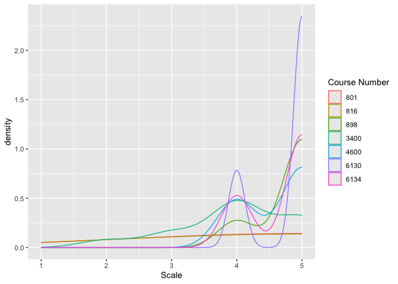
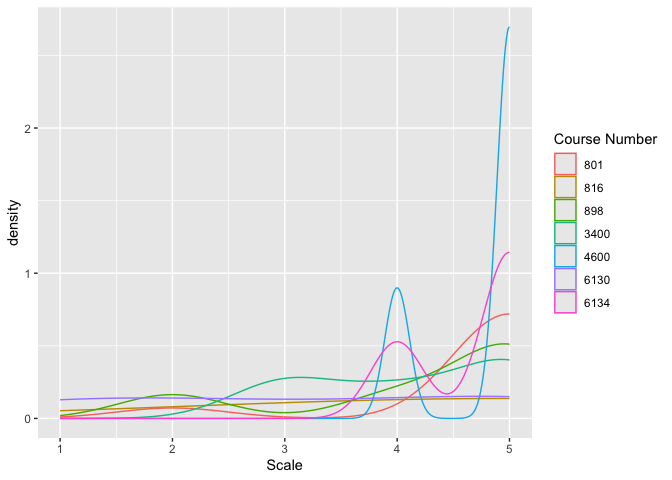
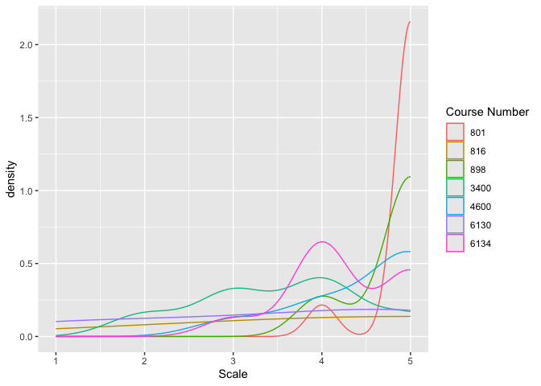
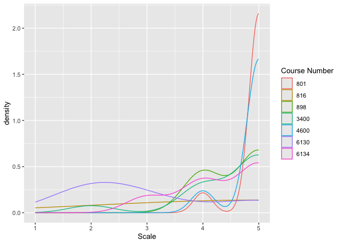
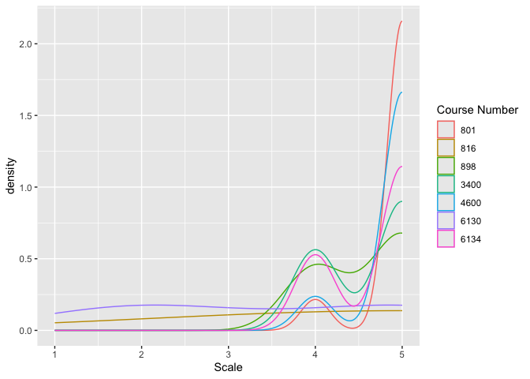
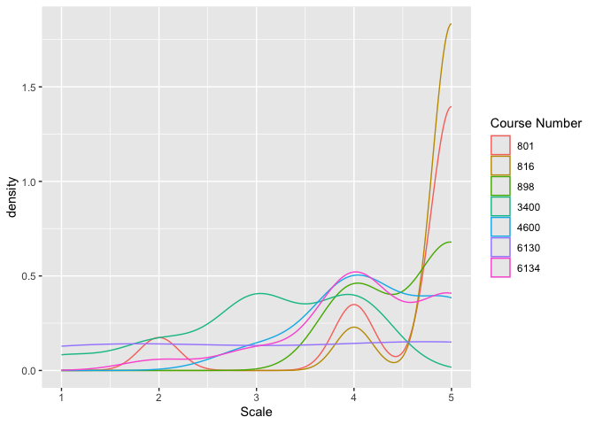

Daniel Fuller, Ph.D.  
Canada Research Chair in Population Physical Activity  
Assistant Professor  
School of Human Kinetics and Recreation   
Physical Education Building PE 2024 Memorial   
University of Newfoundland St. John’s, NL  
A1C 5S7  
Tel: (709) 864-7270    
E-mail: dfuller@mun.ca    
Web: [http://www.walkabilly.ca/](http://www.walkabilly.ca/)  

# Table of Contents 

# Brief Biography

I have been an assistant professor and Canada Research Chair in Population Physical Activity in the School of Human Kinetics and Recreation at Memorial University of Newfoundland since August 1, 2016. From 2015-2016 I was a limited term assistant professor in the School of Public Health at the University of Saskatchewan. Between 2012 and 2014 I was a postdoctoral fellow in the Department of Community Health and Epidemiology at the University of Saskatchewan and from 2008 to 2012 I was a PhD student in Public Health at _Université de Montréal_. I have taught 10 different courses in kinesiology and public health since 2010. The focus of my teaching has been in two broad areas. First, methodological and statistics courses. Second, capstone and foundational courses in public health and social determinants of health. In 2016 I won the _Most Effective Professor_ award voted by the School of Public Health Student Association at the University of Saskatchewan.

My Canada Research Chair offers me a unique role related to teaching and learning. First, I teach 2.5 course equivalents per year compared to the 5 course equivalents that are typical in my academic unit. Second, I lead a large interdisciplinary research lab. I have developed considerable teaching and learning materials related to the lab and have included those materials in my teaching dossier.  

As a former canoe/kayak coach and someone who has been deeply influenced by teachers and coaches throughout my life, I am committed to creating a positive learning environment for students in my classes and in my lab. Teaching is always a work in progress but to date I feel as though I have demonstrated a breadth and depth of teaching that is consistent with my commitment to lifelong learning.

# Teaching Philosophy

### The important thing is not to stop questioning. Curiosity has its own reason for existing.

#### Albert Einstein

***

My primary intention as a teacher is to create a learning environment in which my students and I can learn together, can understand and critically reflect on threshold concepts. I strive to evoke passion and nuance in my students’ thinking and to promote the integration of concepts and perspective from multiple disciplines. Given the ready availability of information, it is no longer sufficient for learners simply to memorize concepts and definitions. The contemporary challenge for both teachers and learners involves conceptual exploration and innovations that bring together ideas from multiple disciplines to deepen our understanding of the world, appreciating both complexity and ambiguity. As a teacher I collaborate with students in order to create the best learning environment.
 
To accomplish my teaching and learning outcomes I combine technological innovation, inspiring in-class interactive learning and problem based learning. Technological innovations in my courses include podcasting lectures, online forums and mobile availability of course material. Technology, however, cannot be a substitute for human interaction. My class presentations encourage interactions and critical reflection with and among students, providing conceptual brainteasers for students’ reflection to conclude each class. Students need to recognize that universities are integral community members. Through problem based learning opportunities, students are challenged to engage their knowledge and understanding through reflective practice. Problem based learning allows students to explore and learn firsthand the principles of their discipline.

To assess progress toward my teaching and learning outcomes I draw on students’ evaluations, fellow teachers’ peer evaluations, and my students’ accomplishments in major scholarship competitions. These assessment strategies encourage continuous development of my teaching based on students’ learning. A reflexive approach to teaching and learning demands that I remain self-critical and adapt to meeting the changing needs, competencies, and hopes of my students, the fundamental purpose of my teaching practice.
Teaching and learning create remarkable moments in our human experience. From watching the joy of a child ride a bike for the first time to that “aha” moment when a student finally “gets” a challenging concept, such learning moments imprint themselves in our memory. For me, teaching involves that wonder. The hard work of remote and immediate preparation in teaching is transformed into the joy of these indelible learning moments. Although these moments are rare, they are transformative. I am motivated and strive to create such opportunities in each of my courses so that students can experience and prove to themselves they are more and can become more than they have previously believed.

# Teaching Responsibility

## Courses Taught

I have taught 10 different courses over the course of my career. I have developed 3 new courses, one during my postdoctoral fellowship (Population Health Intervention Research), one during my limited term appointment (Social Epidemiology), and one in my current position at Memorial University (Computer Applications for Physical Activity Measurement and Intervention). 

I am committed to open learning and develop public websites for all of my courses at Memorial University (see examples below). These websites allow students to access the course outlines and some of the content for my courses prior to taking the course. This is particularly relevant for _HKR 6130 Computer Applications for Physical Activity Measurement and Intervention_ as this course includes coding and is regarded as very challenging for MPE students. 

| Institution | Year | Term | Course | Topic | Role |
|-------------|------|------|--------|-------|------|
| Memorial University  | 2020 | Winter | HKR 6000 | Quantitative Methods in Physical Education | Instructor |
|  | 2020 | Winter | HKR 6134 | Grad Seminar | Instructor |
|  | 2019 | Fall | HKR 6130 | Computer Applications for Physical Activity Measurement and Intervention | Instructor |
|  | 2019 | Fall | HKR 6134 | Grad Seminar | Instructor |
|  | 2019 | Fall | HKR 6134 |  Grad Seminar | Instructor |
| | 2019 | Winter | HKR 3400 | Social Determinants of Health | Instructor | 
|  | 2018 | Winter | HKR 6134 | Seminar | Instructor |
|  | 2019 | Fall | HKR 4600 | Research Methods | Instructor | 
|  | 2018 | Fall | HKR 6134 | Grad Seminar | Instructor |
|  | 2018 | Winter | HKR 3400 | Social Determinants of Health | Instructor | 
|  | 2018 | Winter | HKR 6134 | Grad Seminar | Instructor |
|  | 2017 | Fall | HKR 6130 | Computer Applications for Physical Activity Measurement and Intervention | Instructor |
|  | 2017 | Fall | HKR 6134 | Grad Seminar | Instructor |
|  | 2017 | Summer | HKR 3400 | Social Determinants of Health | Instructor | 
|  | 2017 | Winter | HKR 6134 | Grad Seminar | Instructor | 
|  | 2016 | Fall | HKR 6134 | Grad Seminar | Instructor | 
| University of Saskatchewan | 2016 | Winter | PUBH 840 | Public Health Capstone | Instructor | 
|  | 2016 | Fall | PUBH 840 | Public Health Capstone | Instructor | 
|  | 2016 | Fall | PUBH 898 | Social Epidemiology | Instructor | 
|  | 2015 | Winter | PUBH 840 | Public Health Capstone | Instructor | 
|  | 2015 | Summer | PUBH 804 | Foundations of Public Health | Instructor | 
|  | 2014 | Fall | PUBH 840 | Public Health Capstone | Instructor | 
|  | 2014 | Fall | CHEP 898 | Population Health Intervention Research | Instructor | 
| Université de Montréal | 2011 | Winter | MSO 6068c | Multilevel Modeling | Co-Instructor | 

### HKR 6000 Quantitative Methods in Physical Education

#### Course Description 
##### [https://walkabilly.github.io/HKR_6000/](https://walkabilly.github.io/HKR_6000/)  
A critical examination of methodological research issues and quantitative research designs in the field of human kinetics and recreation. Examines and applies a variety of statistical analysis techniques which can be used in a variety of research designs. Emphasis is placed on the interpretation and implications of empirical quantitative research in the field. Students will learn statistics using either R or SPSS.

### HKR 6134 Grad Seminar

#### Course Description 
##### [https://walkabilly.github.io/hkr_seminar/](https://walkabilly.github.io/hkr_seminar/)  
This course provides students with a forum to discuss and debate research methods and skills such as manuscript and grant writing. The course is designed to provide students with both conceptual and practical course content, using a variety of formats, to enhance student learning. 
 
### HKR 6130 Computer Applications for Physical Activity Measurement and Intervention

#### Course Description 
##### [https://walkabilly.github.io/HKR6130_MUN/](https://walkabilly.github.io/HKR6130_MUN/)  
This course will introduce students to physical activity measurement using accelerometer devices including smartphones and smartwatches. I will also introduce students to measuring spatial location using Global Positioning Systems. The course will explore conceptual aspects of physical activity and spatial location measurement. Students will design, conduct, and analyse data for a small-scale intervention collecting accelerometer measured physical activity and GPS data. Students will learn programming in R and QGIS for spatial analysis methods.  

### HKR 3400 Social Determinants of Health

#### Course Description
This course provides students with a social, political, economic, environmental, and cultural perspective on health and health inequalities. A concentrated look at contemporary health issues using the social determinants of health model will equip students with critical skills necessary to consider health issues beyond physical pathologies.

### PUBH 840 Public Health Capstone

#### Course Description
This class is designed to be the culminating experience for the MPH program. As such, it integrates content and theory of public health practice as experienced by students through previous course work and practica. It recognizes the 7 core competency domains in public health as defined by the Public Health Agency of Canada and provides opportunities for students to acquire skills in all these domains. In addition, this course will introduce certain topics such as communication and leadership which may not have been formally covered previous in the program. The course is taught by a team of instructors comprised of faculty and other professionals, and uses lectures and interactive methods such as class discussions, case studies and students’ in-class presentations. In addition, students will be required to write a final report.

### PUBH 898 Social Epidemiology
#### Course Description
This course is designed to present the topic of social epidemiology. Social epidemiology encompasses the study of relationships between health and a broad range of social factors such as racilization/racism, socioeconomic status, sex/gender, etc. Social epidemiology is broadly partitioned into surveillance (i.e., descriptive relationships between social factors and health, tracking of health inequalities over time) and etiology (i.e., causal effects of social exposures on health). This course will broadly cover the definition of social epidemiology, a historical discussion of social epidemiology’s past, causality, topics in social epidemiology (e.g., race/ethnicity) and discuss intervention strategies to act on the social determinants of health. The course is heavily focused on readings and class discussion. Students are expected to read each article for the week and come to class ready to discuss. 

### PUBH 804 Foundations of Public Health
#### Course Description
To introduce key concepts related to Public Health and their practical applications in the Public Health field. To review key concepts of biostatistics. 

### CHEP 898 Population Health Intervention Research
#### Course Description
The purpose of the course is to review definitions, theories, methods and underlying assumptions of population health intervention research, to examine the evidence-base for evaluating population health interventions, to review local real world interventions and discuss evaluation directions and challenges. Students are expected to be engaged participants and co-learners as this is the first time the course is offered. On-going discussion and evaluation of scope, content and format will be sought as the course is unfolding.

### MSO 6068c Multilevel Modeling
#### Course Description
This course aims to allow students to familiarize themselves with the basic concepts and certain methods of multilevel analysis. The concepts of hierarchical structure of databases, fixed and random effects as well as units of analysis will be presented. The limits of hierarchical data analysis techniques based on the linear model are presented and serve to justify the generalization towards a more suitable model for multilevel analyzes. The methods are illustrated throughout the course using examples. Students will learn R, SPSS, and HLM software.

# Built Environment and Active Populations Lab

In my role as the director of the Built Environment and Active Populations (BEAP) Lab, I both supervise graduate students but also hire and train numerous highly qualified personnel from various disciplines including HKR, public health, computer science, and geography. The vision, mission, and motto of the lab serve to help create a foundation of high quality training. 

__Vision__
A physically active Canadian population

__Mission__
To conduct research that will help design urban environments that equitably increase physical activity for the entire population

__Motto__
"On se dit les vraies choses." _Marianne Beaulieu_ We provide positive criticism and work honestly to do the best possible research. The quote is from one of my dear friends and PhD colleagues.

I spend considerable time and effort training  students at the BEAP Lab. I have developed training materials including a [lab onboarding guide](https://github.com/walkabillylab/labguide), which includes philosophy, ethics, and practical research guidance for team members. All of the students who are involved in the lab complete three online courses

* Tri-Council Policy Statement: Ethical Conduct for Research Involving Humans (TCPS 2) https://tcps2core.ca/welcome
* Newfoundland Personal Health Information Training: Direct Contact with Personal Health Information http://nlchi.skillbuilder.ca/home
* CIHR Sex and Gender in the Analysis of Data from Human Participants http://www.cihr-irsc-igh-isfh.ca/course/index.php

I have also developed training in [statistics](https://github.com/TeamINTERACT/onboarding/blob/master/r_rstudio/r_rstudio.md), [Github](https://github.com/TeamINTERACT/onboarding/blob/master/github/github_intro.md), and [Compute Canada](https://github.com/TeamINTERACT/onboarding/blob/master/databases/data_base_connections.md), among others. This interdisciplinary training is critical for students to develop skills across numerous disciplines. 

# Student Supervision

I both supervise graduate students but also hire and train numerous highly qualified personnel from various disciplines including HKR, public health, computer science, and geography. I have been a committee member for a number of PhD students at various institutions across Canada. Notably, Dr. Henry Luan, my former postdoctoral fellow is a currently an assistant professor in Geography at the University of Oregon. One of my MSc students has received CIHR funding and another was shortlist for CIHR funding. One previous lab member has is currently a faculty member at the University of Copenhagen. Another lab member is conducting a postdoctoral fellowship at the University of Toronto, while another has gone on to a successful career at Cisco Systems in Ottawa. 

### Undergraduate Student Supervision

| Name | Program | Project | Term |
|------|--------|--------|------|
| Nana Abekah | Computer Science | BSc | Fall 2019 Winter 2020 |
| Utsav Koju | Computer Science | BSc | Fall 2019 |
| Sudeny Hector | Human Kinetics and Recreation | Undergraduate Honours | 2018 |
| Harshal Deshpande  | Human Kinetics and Recreation | BSc | Fall 2018 Winter 2019 |
| Levi Moulton  | Human Kinetics and Recreation | BSc | Fall 2018 Winter 2019 |
| Logan Slade | Human Kinetics and Recreation | MUCEP | Fall 2018 |
| Abbie Humphreys | Humanities and Social Sciences | MUCEP | Summer 2018 |
| Desiree van Heerden | Engineering | Co-op Student | Summer 2017 |
| Mehnaz Tabassum | Business | MUCEP | Summer 2017 |
| Melissa Tobin | Human Kinetics and Recreation | Undergraduate Honours | 2017 |
| Alyssa Milley | Human Kinetics and Recreation | Undergraduate Honours | 2017 |
| Hilary Gosse | Human Kinetics and Recreation | Undergraduate Honours | 2017 |

### Graduate Student Supervision  

* 2020: Ryan Ellis. _Thesis title TBD_. MSc Program. Supervisor. School of Human Kinetics and Recreation. Memorial University.
* 2020: Summayah Mussa. _Thesis title TBD_. MSc Program. Supervisor. School of Human Kinetics and Recreation. Memorial University 
* 2020: Asia Holloway. Masters of Public Health Practicum. Supervisor. School of Human Kinetics and Recreation. Memorial University 
* 2019: Rebecca Maher. _Thesis title TBD_. MSc Program. Supervisor. School of Human Kinetics and Recreation. Memorial University.
* 2019: Jonathan Slaney. _Thesis title TBD_. MSc Program. Supervisor. School of Human Kinetics and Recreation. Memorial University.
* 2019: SeyedJavad KhataeiPour. Superior Performance of Machine Learning Algorithms in Metabolic Equivalent (MET) Prediction Using Cell Phone Accelerometer Data. MSc Co-Op. Supervisor. School of Human Kinetics and Recreation. Memorial University.
* 2018: Ali Alfosool.  Road Importance Using Complex-Networks, Graph Reduction & Interpolation. PhD Program. Committee Member. Department of Computer Science. Memorial University. 
* 2018: Machel Rayner. Masters of Public Health Practicum. Supervisor. School of Human Kinetics and Recreation. Memorial University 
* 2017: Kassia Orychock. Association between BMI and WalkScore, Dining and Drinking Score and Grocery Score in a multi-city sample of adults: A cross sectional analysis. MSc Program. Supervisor. School of Human Kinetics and Recreation. Memorial University 
* 2017: Bo Simango. Improving the accuracy of activity intensity classification using machine learning and commercial wearable device data. MSc Program. Supervisor. School of Human Kinetics and Recreation. Memorial University 
* 2017: Melissa Tobin. Examining the association between cycling infrastructure and cycling: Baseline results from INTERACT Victoria. MSc Program. Supervisor. School of Human Kinetics and Recreation. Memorial University
* 2017: Nathan Taylor. Masters of Public Health Practicum. Supervisor. Neighbourhood Active Living Potential on the Avalon Peninsula. Memorial University
* 2014:	Satyadeva Challa. Masters of Public Health Practicum. Supervisor. Stress Mapping and Network Connectivity Analysis. School of Public Health. University of Saskatchewan.
* 2013:	Anna Chen. Masters of Public Health Practicum. Supervisor. Analyzing road surface conditions, time of the day, and road structural factors associated with bicycle collisions from 2000 to 2010 in Saskatoon, Saskatchewan. School of Public Health. University of Saskatchewan.

### Committee Member  

* 2020: Ryan Collins. Associations between Circadian Rhythm, Physical Activity, Mood, and Cognitive Function During the First Year of Treatment for Breast Cancer. Doctor of Psychology. Committee Member. Department of Psychology. Memorial University. 
* 2019: Kole Phillips. Novel measures of physical activity: String Analysis of Behavior Log Elements (StABLE). MSc Program. Committee Member. Department of Computer Science. University of Saskatchewan. 2019.
* 2018: Pablo Navarro. The Government of Newfoundland and Labrador’s implementation of a “Health in All Policies”. PhD Program. Committee Member. Faculty of Medicine, Division of Community Health and Humanities. Memorial University. 
* 2017: Se’era Anstruthers. PhD Program. Committee Member. The Influence of Socioeconomic Factors and Location on the Impact of Children in Healthy Start-Depart Sante. Department of Nutrition. University of Saskatchewan. 
* 2016: Adriana Fonseca. PhD Program. Committee Member.  Physical activity and chronic back disorders in Canadian adults. Department of Community Health and Epidemiology. University of Saskatchewan.
* 2016: Kate Hosford. MSc Program. Committee Member. Impacts of a Public Bike Share Program in Vancouver, BC: Changes in Population Cycling Levels and Program Perceptions and Attitudes. Faculty of Health Sciences, Simon Fraser University.
* 2015: Larisa Lotoski. PhD Program. Committee Member. A 4-season longitudinal study examining the association between seasonality and sedentary behaviour in 8-11 year old Canadian children. Department of Community Health and Epidemiology. University of Saskatchewan. 
* 2013:	Lisa Thurairasu. MSc Program. Committee Member. Examining Individual and Area Level Income Inequalities in Urban Saskatchewan: A Case of Diabetes. Department of Community Health and Epidemiology. University of Saskatchewan.
* 2011:	Mariève Thetreault-Deslands. MPH Program. Committee Member. Utilitarian walking and diabetes: a cross-sectionnal study in Montreal, Canada. Departement de Medecine sociale et preventive. Faculte de Medecine. Universite de Montreal.
* 2010:	Geneviève Boily. MPH Program. Committee Member. L’association entre l’utilisation du transport actif et l’etat de sante auto-rapporte chez des adultes montrealais. Departement de Medecine sociale et preventive. Faculte de Medecine. Universite de Montreal.

### Post Doctoral Fellows

| Name | Program  | Completion | Institution | 
|------|---------|------------|-------------| 
| Hui (Henry) Luan | Post Doctoral Fellow | 2018 | Memorial University | 

### Research Assistants  

| Name | Program  | Department | Institution | Time Frame |
|------|---------|------------|-------------| --------- |
| Megan Devries | MSc Student | Political Science | Memorial University | 2019
| Javad Rahimipour Anaraki | PhD Student | Computer Science | Memorial University | 2017-2019
| Wei Liu | PhD Student | Geography | Memorial University | 2019
| Emily Collwell | MSc Student | Kinesiology | Memorial University | 2017-2019
| Arastoo Borzogi | PhD Student | Computer Science | Memorial University | 2017-2020
| Majid Beheshtimoh | MSc Student | Computer Science | Memorial University | 2018
| Maria Yulmetova | MSc Student | Geography | Memorial University | 2018
| Richard Buote | PhD Student | Community Health | Memorial University | 2016-2018
| Samantha Breslin | PhD Student | Anthropology | Memorial University | 2018
| Jonathan Low | MSc Student | Kinesiology | Memorial University | 2016-2018
| Faramarz Dorani | MSc Student | Computer Science | Memorial University | 2016-2018

# Course Development

I have developed three new courses during my career. The most recent course I would like to highlight is called **Computer Applications for Physical Activity Measurement and Intervention** (HKR 6130). This is a graduate level course where students learn concepts of data science and intervention evaluation applied to wearable device and accelerometer data. I have offered the course twice since 2017. This course has been a great learning experience for me and the students. I can envision this course being transformed to an undergraduate course or modified to meet teaching needs in data science for students who use different types of data. 

I have also developed a Social Epidemiology course and a Population Health Intervention Research course both at the graduate level. These courses have each been offered once. The courses were well received by student but unfortunately, I have not had the chance to teach these courses more than once because of career changes. 

# Administrative and committee work

I have done some administrative work related to teaching and learning. I co-led a review with Dr. Kim Cullen of university undergraduate statistics courses at Memorial University. This review was in order for the School of Human Kinetics and Recreation to determine appropriate course equivalencies for student requirements related to undergraduate statistics. 

I also participated in a graduate program review for the School of Human Kinetics and Recreation in 2017. This review was designed to revise and refine our graduate programs in order to allow students more flexibility in their MSc course requirements and the ensure that the School would be able to recruit students across a variety of kinesiology and health science disciplines. 

# Educational Outreach

The BEAP Lab participated in the St. John's English Language School District Mini Enrichment Course Program. This program invites high achieving high school to Memorial University for a two day workshop. I developed a two day course in accelerometer and global positioning systems and data science. 

### Physical Activity Data Science

#### Course Description 

##### [https://github.com/walkabillylab/physical_activity_data_science](https://github.com/walkabillylab/physical_activity_data_science)**  

The course will introduce students to the measurement of physical activity using accelerometers and global positioning systems in smartphones and wearable devices. With the data students collect we will introduce basic concepts of data science including reading in data, data visualization, and basic math functions using the R statistical programming language.

# Professional Development in Teaching  

I have participated in numerous professional development activities in teaching and learning over the course of my career. Foundational to my teaching philosophy and approach were three courses I participated in 2007 and 2008 during my MSc degree. These courses covered topics such as philosophy of science (Graduate Studies and Research 987: Science, Scientists, and Science-Societal Interactions: An introduction to the dynamics of science), teaching and learning (What the best college teachers do reading group), and evidence based teaching (Making Teaching Visible: Practical principles for peer review of teaching). 

In 2019 and 2020 I am participating in a series of teaching and learning courses offered by the  Centre for Innovation in Teaching and Learning at Memorial University. These courses focus on practical guidance for teaching improvement, documenting teaching effectiveness, and getting better feedback from students. 

* 2019:	An Introduction to Documenting Teaching Activity and Effectiveness. Centre for Innovation in Teaching and Learning, Memorial University. 
* 2017:	Transformational Teaching and Learning Day. Centre for Innovation in Teaching and Learning, Memorial University. 
* 2014:	Teaching Improvement Project System (TIPS) Course. College of Medicine, University of Saskatchewan.
* 2014:	How People Learn: Seven Research-Based Principles for Smart Teaching, College of Medicine, University of Saskatchewan.
* 2008:	What the best college teachers do, Gwena Moss Center for Teaching Effectiveness, University of Saskatchewan.
* 2007	Graduate Studies and Research 987: Science, Scientists, and Science-Societal Interactions: An introduction to the dynamics of science, Gwena Moss Center for Teaching Effectiveness, University of Saskatchewan.
* 2007:	Making Teaching Visible: Practical principles for peer review of teaching, Gwena Moss Center for Teaching Effectiveness, University of Saskatchewan.
* 2007:	Teaching… if only we knew the questions? Gwena Moss Center for Teaching Effectiveness, University of Saskatchewan.

# Teaching effectiveness

Overall, my teaching evaluations from students are positive and evaluations from BEAP lab highly qualified personnel are very positive. As with anything there is always room for improvement. I have included specific comments from students regarding areas for improvement in my teaching and lab management.

## Feedback from Students

Perhaps the strongest evidence related to my teaching effectiveness comes in the form of emails I have received from students. 

#### Teaching Data Science

> Hi Dr. Fuller,  
> Much appreciated. The grouping within the Geom_smooth called worked.
> In the name of feedback, I must say, I have very much enjoyed the R content in this course. I was quite skeptical to begin, as I had done some programming during my undergrad and hadn't thoroughly enjoyed it.  
>I have been pleasantly surprised!  
>Cheers  
> John Halley

#### Research Training

> Dear Dr. Fuller,  
> I hope you are doing well. I just wanted to let you know how impactful your work with me during my honours thesis has been. I recently got a job as a research assistant where I am writing the literature review for my university’s dean of education. I will be attending a conference in China next year for it. Also, I am going to China for 3 months to do my own research project with a MITACS grant. I wanted to thank you from the bottom of my heart for helping me get these opportunities indirectly, and more importantly inspiring me to go down the research route. I hope Newfoundland is treating you well and I want you to know how grateful I am. 
> Thanks  
> Sydney Hector 

## Course Evaluations

The course evaluation questionnaire is Memorial Universities standardized course evaluation questionnaire. I include the CEQ for all of my course where they are available. Some courses had too few responses and results were not made available (see Appendix). 

Additionally, I have conducted my own course evaluations for HKR 3400, HKR 6134, HKR 4600, and HKR 6130. The data are from 13 students in HKR 3400 (out of a possible 62 students), 20 students in HKR 6134 (out of a possible 35), 8 students in HKR 4600 (out of a possible 22), and 4 students in HKR 6130 (out of a possible 12). The questions posted were 
    1. The instructor used challenging questions   
    2. The instructor was willing to listen to student opinions  
    3. The instructor was actively helpful to the students  
    4. The instructor had a genuine interest in student learning  
    5. The course materials (e.g., readings, notes, in‐class exercises) facilitated learning  
    6. The general atmosphere in this course was good for learning  
    7. The instructor related to students in ways that promoted mutual respect  
    8. The instructor provided adequate opportunities for questions and discussion during class time  
    9. Students were invited to share their ideas  
    10. In this course, I felt motivated to learn  
    
Below I present only a figure that shows my scores for each question for each course. The scale is 1 being lowest or worst and 5 being highest or best. 

##### 1. The instructor used challenging questions

<!-- -->

##### 2. The instructor was willing to listen to student opinions

<!-- -->

##### 3. The instructor was actively helpful to the students

<!-- -->

##### 4. The instructor had a genuine interest in student learning 

<!-- -->

##### 5. The course materials (e.g., readings, notes, in‐class exercises) facilitated learning 

<!-- -->

##### 6. The general atmosphere in this course was good for learning

<!-- -->

##### 7. The instructor related to students in ways that promoted mutual respect

<!-- -->

##### 8. The instructor provided adequate opportunities for questions and discussion during class time  

<!-- -->

##### 9. Students were invited to share their ideas

<!-- -->

##### 10. In this course, I felt motivated to learn  

<!-- -->

### Comments from HKR 3400 Winter 2018

Fuller, Daniel - HKR 3400 (crn: 88389)  
Q 14 = If you had to select the best aspects of this course, what would they be?  
Q 15 = What aspects of this course could be improved and how could they be improved?  
Q 26 = Instructor requested feedback (if applicable)  

| Q  |  Comment |
|----|---------------------------------------------------------------------------|
|14 |  Good instructor always willing to help when needed, gives good feedback and is clear|
|14 |  the feedback of article draft to then expand for final paper! Final paper so much better after feedback - opens eyes to new ideas and perspectives when feedback received |
|14 |  I enjoyed the lightning talks and listening to different things that interest individuals |
|14 |  Dr. Fuller had course notes well written, organized, and easily accessible on D2L. His grading was fair and he provided appropriate feedback. He was willing to meet with students to discuss their final paper and gave helpful advice. |
|14 |  great instructing |
|15 |  organization, format of exams |
|15 |  the instruction for the assignments were poorly given, a lot of confusion when knowing what was expected. The course could have been offered online with the content. |
|15 |  Too many group assignments and discussions that wasted time. I would have learned more if the professor spent the majority of class time lecturing. This course has great concepts, however I wanted to see more coming from the professor as that is how I learn best. Participation marking was easy marks but unless you are comfortable speaking in front of a class all the time then you may want to avoid it. |
|15 |  Link the book and notes more to the exams |
|15 |  Organziation and feedback provided for draft article, and provide what is expected for midterm |
|15 |  the course material could have been more detailed |
|26 |  Dr. Fuller is very approachable and is overall a nice guy. I know that he is very knowledgeable in his area and I wish he shared his insight more. |

### Comments from HKR 6314 Winter 2017

Fuller, Daniel - HKR 6314 (crn: 63291)  
Q 14 = If you had to select the best aspects of this course, what would they be?  
Q 15 = What aspects of this course could be improved and how could they be improved?  
Q 26 = Instructor requested feedback (if applicable)   

| Q | Comments |
|----| ---------------------------------------------------------------------------|
|14 |  Dr. Fuller's creativity and ability to create diverse seminars that link together research and it's applicability to the world as we know it. He does a great job of encouraging us to think critically and analyze every aspect of a paper (even if he encourages to tell us how bad his papers are sometimes) |
|14 |  The instructor of this course prepared helpful materials and topics in every class for students. These materials helped all students deeply think about research process and methods.|
|15 |  I think this course was perfect. I appreciated the instructor of this course. |
|15 |  This course has already undergone a huge improvement from F2016 and W2017 semesters. Keep it up!|

### Comments from HKR 4600 Fall 2018

Fuller, Daniel - HKR 3400 (crn: 88389)  
Q 14 = If you had to select the best aspects of this course, what would they be?  
Q 15 = What aspects of this course could be improved and how could they be improved?  
Q 26 = Instructor requested feedback (if applicable)  

| Q | Comments |
|----| ---------------------------------------------------------------------------|
|14 |  The in-class handouts as they aided in students understanding what concepts may or may not be important for examination |
|14 |  Group work and discussion in class |
|14 |  Designing your own research project and the freedom/creativity associated with it |
|14 |  The assignments were fair and an easy way to boost your grade |
|14 |  Loud voice. Does not get boring to listen too. Nice prof. |
|15 |  More guidance on how to write scientifically (through class instruction, tutorials on D2L, etc) |
|15 |  Emphasis on what is important for examination. As someone who put a lot of time studying for the midterm, I was somewhat unprepared for what material truly wound up being on it, and in turn didn't quite as well as desired. Assignments should better reflect material to know for examination |
|15 |  Organization or enforced due dates |
|15 |  Overall the course taught me the basics of research, and Dr. Fuller wa respectful, nice, and helpful when answer questions. I don't the the final exam is necessary since the research project is a lot of work. |

### Comments from HKR 6130 Fall 2019

Fuller, Daniel - HKR 6130 (crn: 70728)  
Q 14 = If you had to select the best aspects of this course, what would they be?  
Q 15 = What aspects of this course could be improved and how could they be improved?  
Q 26 = Instructor requested feedback (if applicable)  

| Q | Comments |
|----| ---------------------------------------------------------------------------|
|14 |  The concept of looking at interventions and how to make them more efficient was interesting |
|14 |  The best aspect of the course was how helpful the professor was. The course was very difficult with some coding to learn, and Dr. Fuller was always very helpful and ready to answer questions |
|14 |  I wnjoyed learning about the theory of wearable technology and how it be applied in practice |
|15 |  Terrible course organization. It is one thing to not have deadlines but another to also not get any feedback for assignments in a timely manner. It leaves students in the unknown of expectations and if they are on the right path, some guided learning would be beneficial. Instead of having so much theory on intervention - have more real life intervention to analyse as it makes the learning for grounded in present day. R program is too advanced. R is great for MKin students who will move on to do research. This course, as is, is not at all suited for the MPE student. Although the theory behind teachers knowing "how to code" is a good one, using R is much beyond our scope and that of the teaching curriculum and teachers. Ie. in elementary I have seen the coding robots, Minecraft, coding games utilized. Those are application to teachers. Rather than just using R, utilizing examples that could be relevant to actual teaching ins schools would be better for an MPE student  |
|15 |  The coding portion was incredible overwhelming and challenging. It is not material that I am likely to apply to my work and I would have liked to see more on the theory and application of wearable technology |
|15 |  The course was great. I really enjoyed it. |

## Feedback from Lab Members

__1. How was your overall experience working in the lab?__  

* Although brief, my overall experience working in the lab was very positive! 
* Very positive and productive.
* It was great! I have learned a lot about how a research is defined, designed and implemented in a respectful, friendly and collaborative environment
* A very lovely experience 
* Totally satisfying. 

__2. How did your fellow lab members make you feel/how did you feel in the lab environment (approachable? Comfortable to talk to? Easy to work with?)__  

* Due to COVID-19 restrictions, I did not spend very much time with many fellow lab members. My interactions with the lab team consisted of weekly lab meetings which were always kind, welcoming, and comfortable. 
I worked closely with another student and Dr. Fuller, both of whom were easy to work with and very approachable. 
* No problems, everyone was kind and easy to talk to.
* The more people are exposed to lab atmosphere the more they understand the harmony and the dynamics of the lab which will end up making them more approachable. This was not the case for some members
* Very approachable whenever I need help/advise/info; everyone in the lab is easygoing and it is absolutely a pleasure to work with the lab members
* Easy to work with
 
__3. What is the most valuable thing you learned?__  

* Health Impact Assessment skills and experience
* How to find appropriate statistics in the sea of endless statistical data (work in progress)
* Learned a great deal about programming and GIS, very helpful for the projects in the lab and my current work.
* Being a team player
* Collaboration and coordination
* Respect and team work. 

__4. What else did you learn?__  

* A variety of technological tools
    - GIS, app development, BEAP engine, etc. 
    - Boolean search operators
    - Project management tools (eg. Gantt charts)
    - Color scheme tools 
    - About the global Vision Zero platform
    - The structure and role of municipal government
    - About urban sprawl
    - how to translate academic language into news-worthy, laymen terms 
* Working with Covidence was an additional skill that was super helpful for projects after I left the lab, and exploring the built environment literature gave me the ability to discuss projects that fall outside my primary interests in a number of conference settings. 
* How to be a good listener
* Sleep behavior and health data

__5. How do you think your work/experience in the lab could have been different?__  

* I think that my experience in the lab would have been dramatically different if it weren't for pandemic conditions. Working from home was challenging and I was not as productive as I would have liked to have been/would have been under normal circumstances. 
Given the challenges and uncertainty of working from home, I think I could have asked for more feedback/guidance from Dr. Fuller. I probably would've been able to accomplish more in this short timeframe if I had asked for more guidance, thus benefiting both myself and the lab. 
I also could've started my final op-ed and report sooner, allowing more time for the editing and co-writing process. 
* My work was very independently led, I was comfortable with that approach and enjoyed my time but I can understand if others would be interested in more structure and guidance during the early stages of a project. Of course, this may have been a function of my role, this may not be a generalizable observation. 
* If there were more fun and outdoorsy activities, say once a month, it would help and motivate lab members be even more productive
* Be more focused on one project only at the same time
* if worked in a group of at least three people. 

__6. What would you like to learn that you didn’t get to?__  

* Actor mapping 
* Who is responsible for what (municipal, provincial, federal, other, etc.) re: road safety, maintenance, snow clearing, and other walkability issues.
* How to establish a webpage and internet platform (Vision Zero NL)
* The project and skill development I experienced were very fulfilling, my only wish is that I was able to generate a concrete deliverable during/following my time in the lab. That being said, my time was short, so this may not have been feasible. 
* I guess I have learned so many new things which I cannot think of anything
* Understand more about health data and their analysis

__7. Is there anything else about your experiences that you would like to share?__  

* I would like to conclude with a big thank you to Dr. Fuller for taking me on as an MPH practicum student under such short notice. I am deeply appreciative and grateful for his flexibility and guidance. 
* It was a wonderful opportunity to work in the BEAP lab and I will always be grateful for the experience. All the best in the future!
* You are awesome!
* I really enjoyed working there. 

## Peer Evaluations of Teaching

__Reviewer__  
Serene Smyth. PhD Student in Kinesiology, Aboriginal Health Curriculum Coordinator- College of Medicine.
  
__Venue/Date__  
Kinesiology 223-Contemporary Health Issues. May 16th and 17th, 2012
  
__Audience__  
2nd year medical students  
  
__Title__  
The Built Environment and Physical Activity  

__Description__  
A 2 day in depth lecture on how the built environment affects physical activity and the health of communities. Day one involved a walk downtown to examine urban environment. Day two involved the students evaluating a local neighborhood.

__Evaluation__  

* Objectives clear? 3/5
    - They weren’t posted on the slides, but he orally explained them to the students at the beginning of each lecture. I also did not ask him to post them. 
* Content appropriate?	4/5
    - Yes. Very relevant to the determinants of health model that our class focusses on. 
* Timing/Amount of material?	5/5
    - Good. An appropriate amount of information for the students. Good balance of lecture, discussion, and active learning.  	
* Active learning?	5/5 
    - Yes. The students got to determine their neighborhoods walk score, they got to engage in 2 outdoor sessions, one of which they did an actual built environment assessment. 	
* Use of AV? 	5/5
    - Powerpoint. Good amount of text per slide. Lots of interactive parts in the session. Looking at maps of neighborhoods, calculating walk score, tracking location online ect. 	
* Response to Questions?	5/5
    - Excellent. Use of personal experiences and research from the literature to frame answer.
* Other Comments	
    - Very engaging presenter. Captured student’s interest. 
    
* OVERALL	5/5
    - Excellent. Students very engaged, and had thoughtful questions. Some expressed interest in learning more about built environment research and going into programs that focus on built environment. 	

1-5 Scale. 1-inadequate (does not meet the standard). 2-borderline. 3-good (top 50%). 4-very good (top 25%). 5-excellent (top 5%).

## Teaching Awards

* 2016 Most Effective Professor. School of Public Health Student Association. University of Saskatchewan.

# Appendices

## Course Syllabi

## Memorial University CEQs

